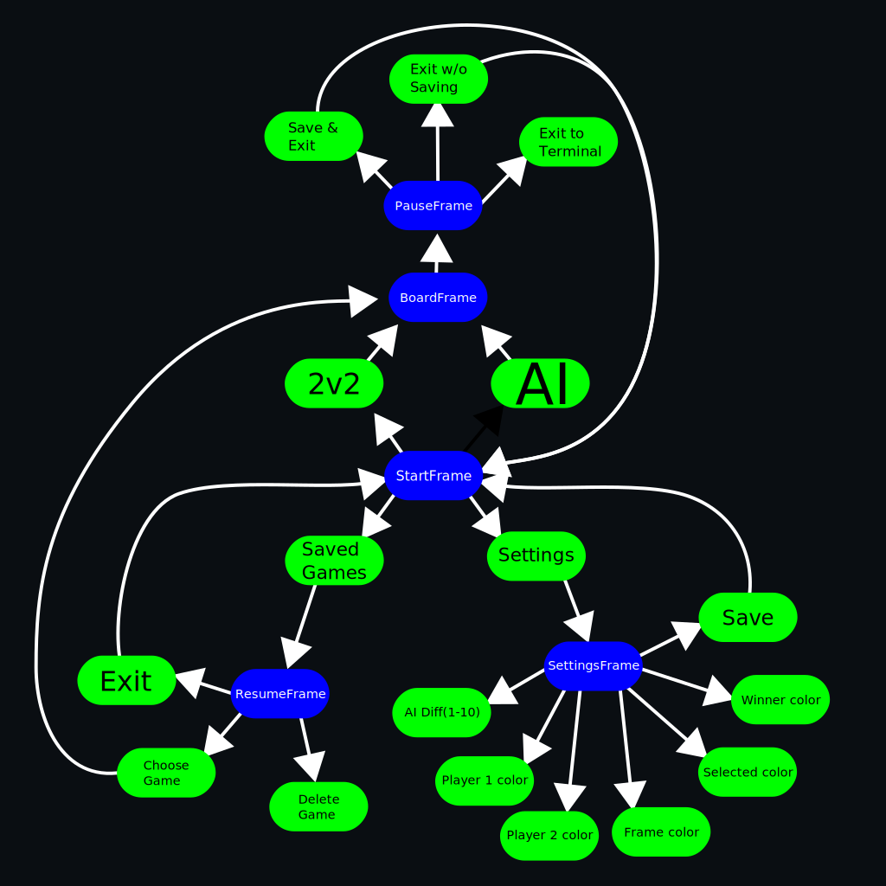

# Connect 4
## This project will be a C++ implementation of the classic board game 4 in a row.
It will have a menu to choose colors and shapes using ANSI escape codes. These colors will also be useful to do some simple animations, and indicate wins and losses.
In the start menu you will be presented with a few options, namely 2v2, play against AI (using a minmax algorithm), load saved games, and settings.

It will be made in Linux, written in C++ 11, and compiled with G++ 11.3.1
Options for moving will be (UP,DOWN,LEFT,RIGHT) and (W,A,S,D).
Pointers will be used for some array animations.

Object Oriented Programming will be used in Menu, Settings, AI, Continue game, and Display options.
Pieces will inherit colors from settings, animation will inherit speeds, etc.
Polimorphism will be used when animating both pieces, and with manipulating some objects on-screen. 

Encapsulation will be used in each class.
Threads will be used to run the min-max algorithm.
Files will be used to store previous settings, and any saved games.
Exceptions will be detected and, if the program is unable to continue, game will be saved. Vectors will be used to store and show the board.
Stacks and Queues will be used to save some moves and settings.

## This diagram shows Frames in blue, options in green
This diagram shows the first frame (in black), current frame options (green), and frames (blue). As we can see, the user starts with 4 options, 3 of which ideally start a game, and the last one just lets you configure colors.

All green options will be chosen by arrows and enter, while blue options will be chosen via enter, or Backspace in the case of PauseFrame.

[Github link](https://github.com/ZuperZeus/Connect-4/)
