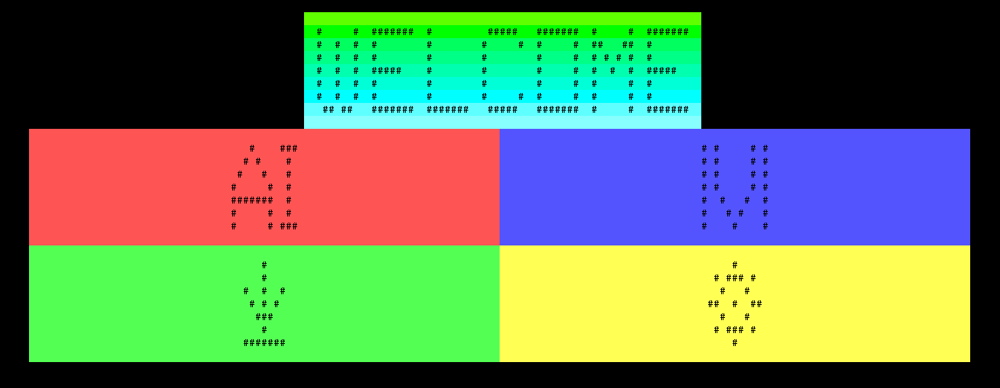

# Connect 4
## This project will be a C++ implementation of the classic board game 4 in a row.

Connect Four (also known as Connect 4, Four Up, Plot Four, Find Four, Captain's Mistress, Four in a Row, Drop Four, and Gravitrips in the Soviet Union) is a two-player connection board game, in which the players choose a color and then take turns dropping colored tokens into a seven-column, six-row vertically suspended grid. The pieces fall straight down, occupying the lowest available space within the column. The objective of the game is to be the first to form a horizontal, vertical, or diagonal line of four of one's own tokens. Connect Four is a solved game. The first player can always win by playing the right moves. [source](https./img//en.wikipedia.or./img/wik./img/Connect_Four)

It will have a menu to choose colors and shapes using ANSI escape codes. These colors will also be useful to do some simple animations, and indicate wins and losses.
In the start menu you will be presented with a few options, namely 1v1, play against AI (using a minmax algorithm), load saved games, and settings.

It will be made in Linux, written in C++ 11, and compiled with G++ 11.3.1
Options for moving will be (UP,DOWN,LEFT,RIGHT) and (W,A,S,D).
Pointers will be used for some array animations.
Object Oriented Programming will be used in Menu, Settings, AI, Continue game, and Display options.

Pieces will inherit colors from settings, animation will inherit speeds, etc.
Polimorphism will be used when animating both pieces, and with manipulating some objects on-screen. 
Encapsulation will be used in each class.
Threads will be used to run the min-max algorithm.
Files will be used to store previous settings, and any saved games.
Exceptions will be detected and, if the program is unable to continue, game will be saved. Vectors will be used to store and show the board.
Stacks and Queues will be used to save some moves and settings.

## This diagram shows Frames in blue, options in green

This diagram shows the first frame (in black), current frame options (green), and frames (blue). As we can see, the user starts with 4 options, 3 of which ideally start a game, and the last one just lets you configure colors.
All green options will be chosen by arrows and enter, while escaping will be done using either the 'x' or Backspace key.

# Frames
These are the frames presented to the user in each menu. (AKA Blue bubbles in the mind map).
They all change size to adapt to the terminal size, but look best when it's at least 50x50.
## StartFrame

## PauseFrame

## SettingsFrame

## SavedFrame

## BoardFrame

[Github link](https./img//github.co./img/ZuperZeu./img/Connect-./img/)
